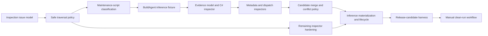

# Next Engineering Set Implementation Plan

## Scope

This plan covers the next three engineering tracks:

1. Docker-BuildAgent-shaped evidence merging and command inference;
2. repository-inspector hardening;
3. clean release-candidate validation.

Detailed decisions are in:

- [Build-Agent evidence and inference](build-agent-evidence-design.md)
- [Inspector hardening](inspector-hardening-design.md)
- [Release-candidate validation](release-candidate-validation-design.md)

This planning change does not edit `TODO-Next.md`. `TODO-Next.md` §3, "Still Open
on the v1 Roadmap," already names these same three tracks and states they are
deliberately not re-planned there, so it is not forgotten; this document is that
planning.

## Recommended order

Inspector foundations come first because new evidence inspectors should use the
same path, issue, and malformed-input contracts from their first commit.
Maintenance-script classification lands immediately before the inference
fixture: the fixture's own baseline depends on it, and the gap it closes
already exists in shipped script inference, independent of anything else in
this set. The inference fixture can then drive implementation.

Materialization (PR 9) depends on both the merged candidates (PR 7) and the
hardened inspectors (PR 8), so it comes after both rather than before either.
New inspectors added from PR 5 onward should use PR 8's hardened traversal,
issue, and malformed-input contracts from their first commit; materializing a
candidate into a generated command is also the point where an inspector
regression first becomes visible as wrong output, which is a reason to have
the hardening in place before that point, not after it. Release-candidate
validation comes last, after the quality and lifecycle commands it
orchestrates are stable.

## Pull-request sequence

### PR 1: Structured inspection issues

Tasks:

- add `InspectionIssues` to the build context;
- add the validated private issue helper;
- expose `Issues` from `Get-PSModuleInspection`;
- attach collected issues to a thrown authoritative-failure exception via
  `.Exception.Data['PSModule.InspectionIssues']`, matching the existing
  `PSModule.PreserveType` pattern in `Invoke-PSModulePluginPipeline`;
- add `Get-PSModuleDiagnostic -IncludeIssues`;
- preserve default plugin-execution diagnostic output;
- add ordering, redaction, and compatibility tests, including a test that
  catches an authoritative failure and reads issues from `.Exception.Data`;
- document issue codes and consumer behavior.

Exit criteria:

- existing callers receive the same default diagnostic records;
- optional issue records are typed, stable, ordered, and tested;
- a caller catching an authoritative failure can read the same typed issue
  records `Issues` would have returned on success.

### PR 2: Harden shared traversal

`Test-PSModuleInspectionPath` already exists, already excludes the configured
output directory plus `.git`, `artifacts`, `bin`, `obj`, and `node_modules`, and
already rejects nested repositories. Every inspector that recurses — project
manifest, PowerShell, NUKE, configuration schema, and OpenAPI — already gates on
it; the inspectors that do not gate on it do not recurse. Centralization is
therefore already done; this PR extends the existing helper rather than creating
one.

Tasks:

- resolve real paths so a symlink or junction cannot admit a file outside the
  repository root;
- add a visited-real-path set to stop symlink/junction cycles and duplicate
  reads;
- normalize comparisons for platform casing rules;
- produce repository-relative `/` paths for diagnostics;
- add cross-platform casing, spaces, nesting, and link fixtures.

Exit criteria:

- no admitted file resolves outside the repository, including through a
  symlink or junction;
- a symlink cycle terminates traversal instead of looping;
- diagnostics report repository-relative paths on Windows and Linux.

### PR 3: Maintenance-script classification

`Get-PSModuleSpecificationCandidate` already ships and already infers a public
command from every `.ps1`/`.psm1` beneath `scripts/`, with no way to mark a
script as tooling rather than a runtime command. That gap is not specific to
Docker-BuildAgent-shaped repositories — any repository with a generator or
maintenance script beneath `scripts/` hits it today — but the BuildAgent
inference fixture is the first thing in this engineering set to depend on a
fix, since its baseline requires `Update-ModuleParameters.ps1` to stay a
generator rather than become a command. This PR must land before that fixture
is added.

The existing script scan already parses each file's AST with
`[Management.Automation.Language.Parser]::ParseInput`; `Ast.GetHelpContent()`
returns the parsed comment-based help block from that same AST, including
`.FUNCTIONALITY`, so no new parsing infrastructure is required.

Tasks:

- recognize a `.FUNCTIONALITY Maintenance` comment-based-help tag from a
  script's existing parsed AST, without executing the script;
- exclude a script carrying that tag from
  `Get-PSModuleSpecificationCandidate`'s command candidates;
- keep a classified script traversed and inspectable as evidence rather than
  silently dropped;
- leave every script without the tag exactly as inferred today;
- add a fixture pair — one marked, one not — proving the distinction directly;
- document the tag in script-inference documentation, since this is a
  behavior change available to every repository, not only this engineering
  set's fixture.

Exit criteria:

- a script carrying the tag never becomes an inferred command;
- an otherwise-identical script without the tag is inferred exactly as before;
- the exclusion is visible in verbose output, not silent.

### PR 4: BuildAgent inference fixture and baseline

Tasks:

- retain the existing authored BuildAgent runtime fixture;
- add the separate empty-specification inference fixture;
- add minimal C#, NUKE, generated metadata, and PowerShell dispatch sources;
- assert current evidence and absence of false inferred commands;
- lock the `$schema` exclusion regression;
- prove inspection executes none of the fixture's scripts or build tools.

Exit criteria:

- the fixture represents the historical pre-PSGenerator architecture without
  depending on an external checkout;
- baseline tests are deterministic on Windows and Linux.

### PR 5: Evidence model and C# source inspector

Tasks:

- add normalized evidence records and validation;
- implement the focused C# tokenizer/structural parser;
- discover build entries and `*Params` inheritance;
- parse XML docs, attributes, defaults, arrays, generics, and nullables;
- detect cycles and unresolved bases;
- add provenance and unsupported-subset issues;
- add the redaction pass that runs once over the complete `CommandEvidence`
  collection before `Get-PSModuleInspection` builds its result, replacing the
  `Value` of any default/configured-value record with a fixed marker when its
  `Subject` has a `Secret = $true` record from any source;
- add a test where the `[Secret]` attribute and the literal default come from
  different sources inspected in each order, proving redaction does not
  depend on inspection order.

Exit criteria:

- representative C# sources produce normalized evidence without compilation;
- unsupported or malformed optional sources do not erase other evidence;
- a secret parameter's literal value never reaches `Get-PSModuleInspection`'s
  `Data`, regardless of which source asserted the value and which asserted
  the secret classification, or their relative order.

### PR 6: Generated metadata and PowerShell dispatch

Tasks:

- inspect conventionally located generated `parameters.json`;
- reconcile its schema with C# and NUKE identities;
- extend PowerShell AST discovery for literal exports, `ValidateSet`, dispatch,
  and static arguments;
- classify explicit and conventional files correctly;
- add malformed, dynamic-expression, and precedence tests.

Exit criteria:

- explicit public names and runtime mappings are represented as high-confidence
  evidence;
- no repository module is imported during discovery.

### PR 7: Candidate merge and conflict policy

Tasks:

- group evidence by normalized build type;
- implement property-specific precedence;
- suppress a candidate whenever any `Authoritative` record disagrees with
  another, regardless of which one has higher precedence, not only at equal
  precedence;
- merge parameters without weakening secret classification;
- represent static invocation as executable plus argument tokens;
- emit stable conflict issues;
- suppress unresolved or equal-precedence-conflicted candidates;
- expose candidate provenance for diagnostics.

Exit criteria:

- compatible overlaps merge deterministically;
- incompatible evidence is visible and never silently selected;
- a lower-precedence `Authoritative` disagreement suppresses the candidate
  instead of losing quietly to the higher-precedence value.

### PR 8: Remaining inspector hardening

Tasks:

- apply file-boundary error handling across every inspector;
- define supported YAML subsets for Compose, workflows, and OpenAPI;
- harden project manifest, schema, README, PowerShell, and NUKE behavior;
- add Dockerfile continuations, `ARG`-in-`FROM`, stages, and metadata;
- complete the malformed authoritative/optional fixture matrix;
- document stable issue codes.

Exit criteria:

- every inspector follows the same failure policy;
- all supported subsets and recovery behavior have focused tests.

### PR 9: Inference materialization and lifecycle

New inspectors added since PR 5 use the hardened traversal, issue, and
malformed-input contracts from PR 8 rather than being retrofitted onto them.
Materializing candidates into a specification is the point where an inspector
regression would first become visible as a wrong generated command, so it
comes after the inspectors it depends on are hardened, not before.

Tasks:

- materialize accepted candidates into inferred specifications;
- generate wrappers, manifest exports, help, and mappings;
- test build, import, command listing, help, and harmless invocation;
- verify repository-relative runtime path resolution;
- update user and extension-author documentation.

Exit criteria:

- the empty fixture produces usable commands without authored mappings;
- the authored fixture remains unchanged and passing.

### PR 10: Release-candidate harness

Tasks:

- add phase results, prerequisite handling, redaction, and manifest generation;
- orchestrate existing quality, documentation, Pester, coverage, package, and
  container lifecycle commands;
- isolate package installation and prove source modules are not imported;
- create checksums and a complete evidence bundle;
- add cleanup and orchestration tests.

Exit criteria:

- one local command can produce an RC evidence bundle;
- failures are attributable to a named phase and retain useful reports.

### PR 11: Hosted clean-run validation

Tasks:

- add a manual read-only workflow accepting an exact ref;
- run on a clean hosted runner;
- upload the RC bundle on success and failure;
- document prerequisites, operation, interpretation, and final-release handoff;
- execute one main-branch RC and record any follow-up defects.

Exit criteria:

- the same SHA passes package and container MVP lifecycles from clean state;
- the workflow publishes no permanent package, image, release, or site.

## Test strategy

Every PR runs the existing test matrix plus its focused tests. The following
gates apply throughout:

- zero PowerShell parse errors;
- PSScriptAnalyzer and formatting checks;
- packaged-code coverage remains at or above the repository threshold;
- Windows and Linux Pester success;
- deterministic fixture output;
- documentation validation;
- no unexpected worktree changes after generation tests.

Container tests are required when runtime mappings or lifecycle orchestration
change. Documentation-site builds are required when authored site content or the
RC documentation phase changes.

## Compatibility constraints

- preserve authored module specifications and their precedence;
- preserve the current default `Get-PSModuleDiagnostic` output;
- keep maintenance-script classification additive: a script without the
  `.FUNCTIONALITY Maintenance` tag infers exactly as it does today;
- do not execute inspected repository code;
- do not add developer-machine absolute paths;
- do not make Docker-BuildAgent or any other external repository a test
  dependency;
- do not publish artifacts while validating an RC;
- never let a secret parameter's literal value reach `Get-PSModuleInspection`'s
  `Data`, a generated artifact, or a thrown exception's message or data;
- keep each implementation PR independently reviewable.

## Completion definition

This engineering set is complete when:

- a realistic empty-spec NUKE/.NET repository produces usable generated
  PowerShell commands from merged static evidence;
- a script tagged `.FUNCTIONALITY Maintenance` is discoverable but never
  inferred as a public command, in this and any other repository using script
  inference;
- malformed optional inputs warn and continue while authoritative inputs fail
  predictably, and a caller catching an authoritative failure can still read
  the structured issues that led to it;
- an authoritative disagreement is never silently resolved by precedence,
  and a secret parameter's literal value is never exposed regardless of
  which source asserted it or when;
- recursive inspection cannot escape or loop outside its repository;
- the complete MVP lifecycle passes from a clean hosted runner;
- a redacted evidence bundle proves the exact source and outputs validated.
