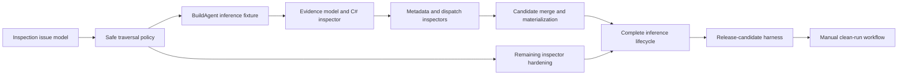

# Next Engineering Set Implementation Plan

## Scope

This plan covers the next three engineering tracks:

1. Docker-BuildAgent-shaped evidence merging and command inference;
2. repository-inspector hardening;
3. clean release-candidate validation.

Detailed decisions are in:

- [Build-Agent evidence and inference](build-agent-evidence-design.md)
- [Inspector hardening](inspector-hardening-design.md)
- [Release-candidate validation](release-candidate-validation-design.md)

This planning change intentionally does not edit `TODO-Next.md`; that file is
being reorganized independently.

## Recommended order

Inspector foundations come first because new evidence inspectors should use the
same path, issue, and malformed-input contracts from their first commit. The
inference fixture can then drive implementation. Release-candidate validation
comes last, after the quality and lifecycle commands it orchestrates are stable.

## Pull-request sequence

### PR 1: Structured inspection issues

Tasks:

- add `InspectionIssues` to the build context;
- add the validated private issue helper;
- expose `Issues` from `Get-PSModuleInspection`;
- add `Get-PSModuleDiagnostic -IncludeIssues`;
- preserve default plugin-execution diagnostic output;
- add ordering, redaction, and compatibility tests;
- document issue codes and consumer behavior.

Exit criteria:

- existing callers receive the same default diagnostic records;
- optional issue records are typed, stable, ordered, and tested.

### PR 2: Safe shared traversal

Tasks:

- centralize recursive enumeration and path admission;
- add repository containment and real-path checks;
- exclude generated, dependency, cache, output, and VCS directories;
- reject nested repositories;
- prevent symlink/junction cycles and duplicate reads;
- normalize repository-relative paths;
- add cross-platform casing, spaces, nesting, and link fixtures.

Exit criteria:

- every recursive inspector uses the same traversal helper;
- no admitted file resolves outside the repository.

### PR 3: BuildAgent inference fixture and baseline

Tasks:

- retain the existing authored BuildAgent runtime fixture;
- add the separate empty-specification inference fixture;
- add minimal C#, NUKE, generated metadata, and PowerShell dispatch sources;
- assert current evidence and absence of false inferred commands;
- lock the `$schema` exclusion regression;
- prove inspection executes none of the fixture's scripts or build tools.

Exit criteria:

- the fixture represents the historical pre-PSGenerator architecture without
  depending on an external checkout;
- baseline tests are deterministic on Windows and Linux.

### PR 4: Evidence model and C# source inspector

Tasks:

- add normalized evidence records and validation;
- implement the focused C# tokenizer/structural parser;
- discover build entries and `*Params` inheritance;
- parse XML docs, attributes, defaults, arrays, generics, and nullables;
- detect cycles and unresolved bases;
- add provenance and unsupported-subset issues.

Exit criteria:

- representative C# sources produce normalized evidence without compilation;
- unsupported or malformed optional sources do not erase other evidence.

### PR 5: Generated metadata and PowerShell dispatch

Tasks:

- inspect conventionally located generated `parameters.json`;
- reconcile its schema with C# and NUKE identities;
- extend PowerShell AST discovery for literal exports, `ValidateSet`, dispatch,
  and static arguments;
- classify explicit and conventional files correctly;
- add malformed, dynamic-expression, and precedence tests.

Exit criteria:

- explicit public names and runtime mappings are represented as high-confidence
  evidence;
- no repository module is imported during discovery.

### PR 6: Candidate merge and conflict policy

Tasks:

- group evidence by normalized build type;
- implement property-specific precedence;
- merge parameters without weakening secret classification;
- represent static invocation as executable plus argument tokens;
- emit stable conflict issues;
- suppress unresolved or equal-precedence-conflicted candidates;
- expose candidate provenance for diagnostics.

Exit criteria:

- compatible overlaps merge deterministically;
- incompatible evidence is visible and never silently selected.

### PR 7: Inference materialization and lifecycle

Tasks:

- materialize accepted candidates into inferred specifications;
- generate wrappers, manifest exports, help, and mappings;
- test build, import, command listing, help, and harmless invocation;
- verify repository-relative runtime path resolution;
- update user and extension-author documentation.

Exit criteria:

- the empty fixture produces usable commands without authored mappings;
- the authored fixture remains unchanged and passing.

### PR 8: Remaining inspector hardening

Tasks:

- apply file-boundary error handling across every inspector;
- define supported YAML subsets for Compose, workflows, and OpenAPI;
- harden project manifest, schema, README, PowerShell, and NUKE behavior;
- add Dockerfile continuations, `ARG`-in-`FROM`, stages, and metadata;
- complete the malformed authoritative/optional fixture matrix;
- document stable issue codes.

Exit criteria:

- every inspector follows the same failure policy;
- all supported subsets and recovery behavior have focused tests.

### PR 9: Release-candidate harness

Tasks:

- add phase results, prerequisite handling, redaction, and manifest generation;
- orchestrate existing quality, documentation, Pester, coverage, package, and
  container lifecycle commands;
- isolate package installation and prove source modules are not imported;
- create checksums and a complete evidence bundle;
- add cleanup and orchestration tests.

Exit criteria:

- one local command can produce an RC evidence bundle;
- failures are attributable to a named phase and retain useful reports.

### PR 10: Hosted clean-run validation

Tasks:

- add a manual read-only workflow accepting an exact ref;
- run on a clean hosted runner;
- upload the RC bundle on success and failure;
- document prerequisites, operation, interpretation, and final-release handoff;
- execute one main-branch RC and record any follow-up defects.

Exit criteria:

- the same SHA passes package and container MVP lifecycles from clean state;
- the workflow publishes no permanent package, image, release, or site.

## Test strategy

Every PR runs the existing test matrix plus its focused tests. The following
gates apply throughout:

- zero PowerShell parse errors;
- PSScriptAnalyzer and formatting checks;
- packaged-code coverage remains at or above the repository threshold;
- Windows and Linux Pester success;
- deterministic fixture output;
- documentation validation;
- no unexpected worktree changes after generation tests.

Container tests are required when runtime mappings or lifecycle orchestration
change. Documentation-site builds are required when authored site content or the
RC documentation phase changes.

## Compatibility constraints

- preserve authored module specifications and their precedence;
- preserve the current default `Get-PSModuleDiagnostic` output;
- do not execute inspected repository code;
- do not add developer-machine absolute paths;
- do not make Docker-BuildAgent or any other external repository a test
  dependency;
- do not publish artifacts while validating an RC;
- keep each implementation PR independently reviewable.

## Completion definition

This engineering set is complete when:

- a realistic empty-spec NUKE/.NET repository produces usable generated
  PowerShell commands from merged static evidence;
- malformed optional inputs warn and continue while authoritative inputs fail
  predictably;
- recursive inspection cannot escape or loop outside its repository;
- the complete MVP lifecycle passes from a clean hosted runner;
- a redacted evidence bundle proves the exact source and outputs validated.
